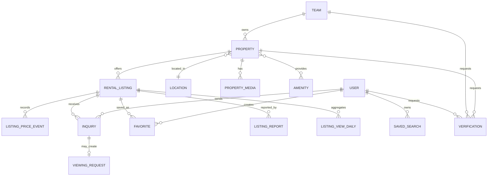
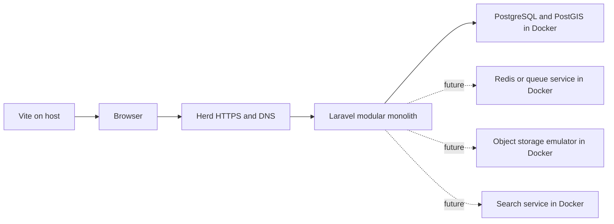

# HonduCasa Rental Marketplace Implementation Guide

## 1. Purpose

This guide defines how to evolve the current Laravel application into a trusted, Central America-first, long-term residential rental marketplace. It translates the product direction into an implementation sequence that can be delivered and verified in small vertical slices.

The first release should help a renter discover a legitimate property, understand its full cost, save it, and request a viewing. It should help an owner or agency publish and manage a verified listing. It should not attempt to become a complete property-management or payment platform in the first release.

## 2. Working assumptions

- Launch market: Honduras.
- Expansion model: the schema and content model support other Central American countries without enabling them at launch.
- Inventory: long-term residential rentals only.
- Supply: individual landlords and real-estate teams/agencies may publish.
- Languages: Spanish is the launch language; all new user-facing strings must be translatable so English can follow.
- Currencies: HNL and USD are accepted listing currencies. The contractual currency is always explicit.
- Authentication: users may register and sign in manually with email/password or continue with Google. Existing passkey and two-factor support remains available.
- Business model: monetization is deferred until the marketplace has healthy supply and demand. The schema may later support subscriptions and promoted listings, but the MVP must not contain hidden ranking advantages.
- Web first: responsive web application; no native mobile application in the MVP.
- Existing teams are the ownership boundary. A personal team represents an individual landlord; a shared team represents an agency or property-management company.
- Production database: PostgreSQL.
- Spatial database baseline: PostgreSQL 17 with PostGIS 3.5.
- Local application runtime and DNS: Laravel Herd. The Laravel application runs through Herd rather than inside Docker during normal local development.
- Supporting services: Docker containers provide PostgreSQL and other infrastructure dependencies. The Laravel codebase remains a modular monolith unless a future scaling or organizational need justifies extracting an independently deployed service.

These assumptions are product decisions, not irreversible technical constraints. Confirm them before starting Slice 1.

## 3. Existing foundation

The repository currently provides:

- Laravel 13 on PHP 8.4
- Inertia 3 with Vue 3 and TypeScript
- Tailwind CSS 4 and the existing reusable UI component library
- Laravel Fortify authentication, email verification, two-factor authentication, and passkeys
- Personal and shared teams with roles, invitations, policies, and team-scoped dashboard URLs
- Laravel Wayfinder with form variants enabled
- Pest 5, Larastan, Pint, ESLint, Prettier, and Vue type checking
- SQLite as the starter kit's current configured database and the local filesystem as the current storage disk; database configuration will move to PostgreSQL in Slice 0

New work must preserve the established patterns: PHP enums, attribute-based fillable declarations, typed relationships, Form Requests, policies, focused action classes, Inertia pages, Wayfinder route imports, Pest feature tests, and flash toasts.

## 4. Product boundaries

### MVP capabilities

#### Renter

- Browse published rentals without signing in.
- Search by location text and map bounds.
- Filter by price, currency, property type, bedrooms, bathrooms, furnishing, pets, parking, utilities, and region-specific amenities.
- Switch between list and map views without losing filters.
- Open a detailed listing with media, costs, policies, approximate location, and publisher trust signals.
- Register or sign in to save listings and saved searches.
- Request a viewing or contact the publisher through an auditable inquiry.
- Report a suspicious or inaccurate listing.

#### Landlord or agency

- Create a property under the active team.
- Create a draft rental listing for that property.
- Add and order photos.
- Preview, submit for review, publish, pause, and archive a listing.
- See inquiries and update their status.
- Manage listing availability.
- See simple performance counts: views, saves, and inquiries.

#### Moderator

- Review submitted listings and verification evidence.
- Approve, reject with reasons, suspend, or request changes.
- Review user reports and record resolution.
- See a durable audit trail of moderation decisions.

### Explicitly deferred

- Rental applications and tenant screening
- Background or credit checks
- Lease generation and electronic signatures
- Deposit handling and recurring rent payments
- Maintenance requests and tenant portals
- Reviews of landlords or tenants
- Short-term/vacation rentals
- Commercial real estate
- Auction or bidding mechanics
- Automated exchange-rate settlement
- Paid ranking that changes organic result order

Deferred features should be designed only when their delivery slice begins.

## 5. Architecture principles

1. **Separate the asset from the offer.** `Property` is the physical place. `RentalListing` is a time-bound offer to rent it. A property can be relisted without losing its history.
2. **Scope supply-side data to teams.** Every property belongs to a team. Authorization starts from membership of that team and is enforced with policies.
3. **Keep public discovery separate from management.** Public listing routes are not nested under a team. Management routes use the existing `{current_team}` context.
4. **Make lifecycle transitions explicit.** Draft, review, publication, suspension, and archival are domain operations, not arbitrary field updates.
5. **Store contractual values, not presentation values.** Store price as integer minor units and currency as an ISO code. Display conversion is informational and must never replace the contractual currency.
6. **Protect exact locations.** Public responses expose an approximate location unless the publisher explicitly permits an exact map pin.
7. **Use the database first.** Start with indexed relational queries and bounding-box map searches. Introduce a dedicated search engine or geospatial extension only after measured limits justify it.
8. **Queue durable external work.** Image processing, notifications, imports, and third-party verification calls use retryable jobs. Lightweight analytics may run after the response when loss is acceptable.
9. **Treat verification as evidence, not a single boolean.** Identity, agency, and property-control verification have separate types, states, evidence, reviewers, and expiry dates.
10. **Make moderation explainable.** Every rejection, suspension, and restoration records the actor, reason, timestamp, and affected entity.
11. **Keep infrastructure replaceable.** Laravel depends on configured database, cache, queue, storage, mail, and search contracts. Docker Compose provides local supporting services without coupling domain code to container names or provider-specific SDKs.
12. **Start as a modular monolith.** Property, listings, discovery, inquiries, verification, and moderation are application modules in one Laravel deployment. Extracting a networked microservice requires measured scaling pressure, a clear ownership boundary, and an operational plan for retries, observability, and data consistency.

## 6. Domain model



### Core tables

#### `locations`

A generic hierarchy accommodates different regional administrative systems.

- `id`
- `parent_id`, nullable self-reference
- `country_code`, ISO 3166-1 alpha-2
- `type`: country, department, province, municipality, city, neighborhood, development
- `name`
- `slug`
- `is_active`
- timestamps

Required constraints and indexes:

- Unique country/type/parent/slug combination
- Index on `parent_id`
- Index on `country_code`, `type`, and `is_active`

Seed only curated launch locations. Do not let publishers create canonical locations from free text. Keep `address_landmark` on the property for local directions.

#### `properties`

- `id`
- `team_id`
- `location_id`
- `created_by`
- `type`: apartment, house, condominium, townhouse, room, studio
- `name`, nullable for unnamed homes
- `slug`
- `address_line`, nullable
- `address_landmark`, nullable
- `coordinates` as `geography(Point, 4326)` containing the exact searchable location
- `public_location_precision`: exact, approximate, neighborhood
- `bedrooms`
- `bathrooms` as a decimal value if half-baths are supported
- `parking_spaces`
- `interior_area_m2`, nullable
- `lot_area_m2`, nullable
- `year_built`, nullable
- `furnishing`: furnished, semi_furnished, unfurnished
- `description`
- timestamps and soft deletes

Index `team_id`, `location_id`, and `type`. Add a GiST spatial index to `coordinates`. Slugs should be unique and route-safe. Exact addresses and coordinates must never be included in public list-card payloads.

#### `rental_listings`

- `id`
- `property_id`
- `created_by`
- `reviewed_by`, nullable
- `status`: draft, submitted, changes_requested, published, paused, rented, rejected, suspended, archived
- `headline`
- `description_override`, nullable
- `currency`: ISO 4217 code
- `monthly_rent_minor`
- `security_deposit_minor`
- `maintenance_fee_minor`, nullable
- `utilities_included` as a structured JSON value only if the set remains small; otherwise use a relation
- `minimum_lease_months`
- `available_from`
- `pets_policy`
- `smoking_policy`
- `application_requirements`, nullable
- `published_at`, nullable
- `expires_at`, nullable
- `reviewed_at`, nullable
- `rejection_reason`, nullable
- timestamps and soft deletes

Important indexes:

- `status`, `published_at`
- `currency`, `monthly_rent_minor`
- `available_from`
- Composite `status`, `published_at`
- Composite `property_id`, `status`

Enforce at the application layer that a property has at most one active published rental listing. Use a transaction and row lock for publication so concurrent requests cannot publish duplicates.

#### `amenities` and `amenity_property`

Amenities are curated filterable values, not arbitrary tags.

Initial categories should include:

- Interior: air conditioning, hot water, laundry, equipped kitchen
- Infrastructure: water tank/cistern, backup generator, fiber-ready internet
- Security: gated community, guard, controlled access, cameras
- Exterior/community: pool, gym, green area, balcony, rooftop
- Practical: parking, elevator, wheelchair access, pet-friendly area

Each amenity has a stable key, translated label, category, display order, and active flag. The pivot may hold an optional detail value where needed.

#### `property_media`

- `property_id`
- `disk`
- `path`
- `type`: image, video, virtual_tour
- `mime_type`
- `size_bytes`
- `width` and `height`, nullable
- `sort_order`
- `alt_text`, nullable and translatable later
- `moderation_status`
- timestamps

Do not expose original upload names or storage paths directly. Generate responsive variants asynchronously and serve them through storage URLs or a CDN. The first approved image by `sort_order` is the hero image.

#### Engagement tables

- `favorites`: unique `user_id`, `rental_listing_id`
- `saved_searches`: user, name, normalized filter JSON, notification frequency, last-notified timestamp
- `inquiries`: listing, user or guest contact, message, source, status, assigned team member, timestamps
- `viewing_requests`: inquiry, preferred time windows, confirmed time, status, cancellation reason
- `listing_reports`: listing, reporter, category, description, state, resolver, resolution notes
- `listing_view_daily`: listing, date, anonymous views, authenticated views; aggregated rather than retaining unnecessary visitor-level data
- `listing_price_events`: listing, old/new amount, currency, actor, timestamp

### Verification tables

Use a polymorphic `verifications` table only for the shared workflow; keep evidence records separate.

- Subject: user, team, or property
- Type: identity, agency, property_control
- Status: pending, verified, rejected, expired, revoked
- Submitted, reviewed, verified, and expiry timestamps
- Reviewer and reason fields

`verification_documents` stores private evidence metadata. Documents must use a private disk, explicit authorization, encryption where appropriate, retention rules, and audit logging. Never return document paths in shared Inertia props.

### OAuth identities

Use a separate `oauth_identities` table rather than adding a `google_id` column to `users`. This keeps account identity independent from the current provider and permits additional providers later without changing the user schema.

- `id`
- `user_id`
- `provider`: initially `google`
- `provider_subject`: Google's stable OpenID Connect `sub` claim
- `provider_email`, nullable informational snapshot
- `linked_at`
- `last_used_at`, nullable
- timestamps

Required constraints:

- Unique `provider`, `provider_subject`
- Unique `user_id`, `provider`
- Index on `user_id`

OAuth-only users require the local `users.password` column to become nullable. Manual registration still requires and hashes a password; Google-created users receive `null`, never a generated password that nobody can recover. Update the model typing, password-management UI, and authentication-method checks accordingly.

Do not use the Google email address as the provider identity because it can change. Do not store Google access or refresh tokens when HonduCasa requests only authentication scopes and does not call Google APIs.

### Enums and state transitions

Use PHP backed enums with TitleCase cases and string values. Centralize permitted transitions in focused action classes, for example:

- `SubmitRentalListingForReview`
- `ApproveRentalListing`
- `RequestRentalListingChanges`
- `PublishRentalListing`
- `PauseRentalListing`
- `MarkRentalListingAsRented`
- `SuspendRentalListing`

Controllers should not set lifecycle fields directly. Each transition authorizes, validates preconditions, runs transactionally, records an audit event, and dispatches notifications after commit.

## 7. Authorization model

### Public users

May view only listings with `status = published`, a non-null `published_at` not in the future, an unexpired publication window, approved media, and an active property/location.

### Authenticated renters

May manage only their own favorites, saved searches, inquiries, viewing requests, and reports.

### Team members

Extend `TeamPermission` with domain permissions rather than relying only on the broad Owner/Admin/Member role names:

- `property:view`, `property:create`, `property:update`, `property:delete`
- `listing:create`, `listing:update`, `listing:submit`, `listing:publish`, `listing:archive`
- `inquiry:view`, `inquiry:assign`, `inquiry:update`
- `analytics:view`
- `verification:submit`

Add permissions to existing roles deliberately. Do not give every current Admin permission by default without a migration and product decision.

### Moderators

Moderation is a platform-level capability and must not be represented as membership in a customer team. Add a platform role/capability mechanism only when the moderation slice begins. Require two-factor authentication for moderator access and record all privileged actions.

Every controller mutation must use a policy or an authorizing Form Request. Nested team/property/listing routes must use scoped bindings or explicit team ownership checks.

### Authentication flows

#### Manual registration and sign-in

Keep Laravel Fortify as the owner of manual authentication:

- Email/password registration
- Email/password sign-in
- Password reset
- Email verification
- Password confirmation
- Two-factor authentication
- Passkeys

Manual registration continues to use `CreateNewUser` so user creation and personal-team creation remain one transaction. Normalize email addresses consistently and retain the existing login throttling. Authenticated marketplace actions should continue using the session-backed `web` guard.

#### Continue with Google

Implement Google authentication with Laravel Socialite after approving and installing the dependency. Use the server-side authorization-code flow with session state protection; do not use `stateless()` for the normal browser flow.

Request only the OpenID Connect `openid`, `email`, and `profile` scopes. The callback must:

1. Validate the OAuth state through the session.
2. Retrieve the Google identity through the provider library.
3. Require a stable provider subject and a verified email claim.
4. Look up `oauth_identities` by provider and provider subject.
5. Sign in the linked local user and regenerate the Laravel session.
6. For a new identity whose email is unused, create the user, mark the verified Google email as verified, create the personal team, attach the OAuth identity, and sign in—all transactionally.
7. For a verified Google email matching an existing local user without a linked Google identity, do not silently link it. Ask the user to sign in with an existing method, then explicitly link Google from security settings.
8. Preserve intended URLs and pending team invitations across the provider redirect.

Google's `sub`, not email, is the permanent provider key. Email may be used to propose an account-linking path but never as the OAuth identity's unique identifier.

#### Linking and unlinking

- Linking Google requires an authenticated session and recent password, passkey, or two-factor confirmation.
- A Google-only account may add a password through a verified password-setup flow.
- Unlinking is forbidden when it would leave the user with no usable authentication method.
- Changing the local email does not alter the provider subject.
- A provider identity cannot be moved between users without a separately designed support recovery process.
- Log link, unlink, and failed-conflict events without storing OAuth authorization codes or tokens.

#### Authentication UI

Both `auth/Login.vue` and `auth/Register.vue` should provide:

- The existing manual form
- A clear separator
- A “Continue with Google” button
- Invitation context preserved in both paths
- Accessible loading, cancellation, and provider-error states

Security settings should show available methods: password, Google, passkeys, and two-factor authentication. Google authentication proves control of a Google identity; it does not grant landlord, agency, property, or moderator verification.

#### Authentication tests

- Manual registration still creates a personal team.
- Manual login, reset, verification, 2FA, and passkey tests remain green.
- Google redirect uses the expected provider and preserves invitation/intended state.
- A new verified Google identity creates exactly one user, identity, and personal team.
- Repeated callbacks sign in the same user and do not duplicate records.
- Unverified or incomplete provider identities are rejected.
- An email collision requires explicit authenticated linking.
- Linking and unlinking enforce recent authentication and the last-method rule.
- OAuth callback failures return a safe user-facing error without exposing provider payloads.
- Socialite is faked in tests; automated tests must not contact Google.

## 8. URL and route design

### Authentication routes

Fortify continues to register manual authentication routes. Add focused Google OAuth routes outside the team prefix:

```text
GET    /auth/google/redirect       auth.google.redirect
GET    /auth/google/callback       auth.google.callback
POST   /settings/connections/google auth.google.link
DELETE /settings/connections/google auth.google.unlink
```

The redirect and callback routes use the `web` session middleware and appropriate guest/authentication behavior. Use invokable controllers and keep provider-account resolution in a transaction-safe action class. The link route may begin a second provider redirect rather than linking immediately; the callback distinguishes sign-in from an authenticated linking intent stored in the session.

### Public routes

```text
GET  /rentals                              rentals.index
GET  /rentals/{rental_listing:slug}        rentals.show
POST /rentals/{rental_listing}/inquiries   rentals.inquiries.store
POST /rentals/{rental_listing}/reports     rentals.reports.store
PUT  /rentals/{rental_listing}/favorite    rentals.favorite.store
DELETE /rentals/{rental_listing}/favorite  rentals.favorite.destroy
GET  /saved-searches                       saved-searches.index
POST /saved-searches                       saved-searches.store
```

### Team management routes

```text
GET  /{current_team}/properties
POST /{current_team}/properties
GET  /{current_team}/properties/create
GET  /{current_team}/properties/{property}/edit
PATCH /{current_team}/properties/{property}
POST /{current_team}/properties/{property}/media
POST /{current_team}/properties/{property}/rental-listings
GET  /{current_team}/rental-listings/{rental_listing}/edit
PATCH /{current_team}/rental-listings/{rental_listing}
POST /{current_team}/rental-listings/{rental_listing}/submit
POST /{current_team}/rental-listings/{rental_listing}/pause
POST /{current_team}/rental-listings/{rental_listing}/mark-rented
GET  /{current_team}/inquiries
PATCH /{current_team}/inquiries/{inquiry}
```

Use resource controllers for CRUD and invokable controllers for meaningful state transitions. Use route model binding by slug for public listings and scoped numeric or slug binding for team management. All Vue links and forms must import generated Wayfinder functions from `@/actions` or `@/routes`; never hardcode these URLs in components.

## 9. Search and map design

### Filter contract

Represent search state in the URL so results are shareable and browser navigation works. Normalize parameters in one query-data object:

```text
location
bounds[north], bounds[east], bounds[south], bounds[west]
currency
price_min, price_max
property_types[]
bedrooms_min
bathrooms_min
furnishing[]
amenities[]
pets
available_by
sort
page
```

Unknown filters are ignored or rejected consistently. Empty values are removed when generating URLs. Validate all bounds and numeric ranges before building queries.

### Query pipeline

Create a dedicated query object, for example `SearchPublishedRentals`, that:

1. Starts from an explicit published scope.
2. Selects only fields needed by cards and map markers.
3. Applies location and bounding-box constraints.
4. Applies price, property, availability, and amenity filters.
5. Eager loads constrained property, location, publisher, and hero media relations.
6. Applies a stable explicit sort with an ID tie-breaker.
7. Paginates list results and returns a separately limited marker payload.

Default ranking should favor relevance and freshness, not publisher size. Sponsored placement, if introduced later, must be visibly labeled and kept separate from organic ordering.

### Initial search implementation

- Use indexed relational filters and escaped `LIKE` matching for curated location names.
- Use PostGIS spatial predicates for visible-map and radius constraints.
- Cap returned markers and cluster them client-side or server-side once density requires it.
- Debounce map movements and cancel stale requests.
- Record query timings and result counts.

PostgreSQL with PostGIS is the database baseline for development, testing, staging, and production. Consider Laravel Scout with a supported search engine only when requirements include typo-tolerant text search or measured query latency exceeds the agreed budget at realistic scale. Any additional search service is a separate dependency decision and must be covered by production-like tests.

### Radius and “Near me” search

Use PostGIS `ST_DWithin` on the indexed `geography(Point, 4326)` column to select properties inside a radius, followed by `ST_Distance` to calculate and order the surviving results. `ST_DWithin` performs the index-aware candidate reduction; filtering only on a calculated distance would evaluate too many rows.

The normalized request includes:

```text
origin[latitude]
origin[longitude]
radius_meters
```

Processing rules:

1. Validate latitude from -90 to 90, longitude from -180 to 180, and radius against an allowed range.
2. Construct the search point with longitude first: `ST_SetSRID(ST_MakePoint(longitude, latitude), 4326)::geography`.
3. Apply all publication, price, property, availability, amenity, and team-safety filters.
4. Apply `ST_DWithin(properties.coordinates, search_point, radius_meters)`.
5. Select `ST_Distance(properties.coordinates, search_point)` as `distance_meters` only for matching rows.
6. Sort by distance with a stable listing-ID tie-breaker unless the renter chooses another sort.
7. Return a rounded human-readable distance and the listing's permitted approximate map marker, never its private exact coordinate.

Offer 1, 3, 5, 10, 25, and 50 kilometre presets, with 5 kilometres as the initial “Near me” radius. The browser requests a single geolocation fix only after the renter chooses “Near me.” Do not continuously track or persist the location. If permission is denied or unavailable, fall back to a named location or a user-selected map pin.

For map-viewport search, construct the visible map envelope and use an index-aware spatial intersection against property coordinates. Radius search and viewport search share the same published-listing query pipeline but use different spatial constraints.

Exact coordinates remain server-side for calculations. Public markers obey `public_location_precision`; approximate markers should be deterministically displaced within an appropriate area so repeated requests do not reveal the original point through random samples.

### Performance targets

- Search server response p95 below 500 ms at the initial target dataset.
- Listing page server response p95 below 350 ms, excluding image transfer.
- No N+1 queries in listing cards, map markers, detail pages, or team dashboards.
- Public card payload remains compact and excludes full descriptions and exact coordinates.

## 10. Inertia and Vue page design

### Public pages

- `rentals/Index.vue`: search shell, filter bar, results, map, sort, empty state
- `rentals/Show.vue`: gallery, price summary, costs, amenities, policies, map, trust panel, inquiry CTA
- `saved-searches/Index.vue`: saved criteria and notification preferences
- `favorites/Index.vue`: saved listing cards

### Team pages

- `properties/Index.vue`
- `properties/Create.vue`
- `properties/Edit.vue`
- `rental-listings/Edit.vue`
- `rental-listings/Preview.vue`
- `inquiries/Index.vue`
- `inquiries/Show.vue`
- `analytics/Index.vue`

### Interaction rules

- Every page has one root element.
- Use `<Link>` for Inertia navigation and `<Form>` or `useForm` for mutations.
- Use Wayfinder objects for form actions and navigation.
- Keep filters in URL query parameters and preserve state/scroll where appropriate.
- Use `useHttp` for map-bound refreshes that should return JSON without changing the page component; use an Inertia visit when URL/history should change.
- Use optimistic updates only for reversible low-risk actions such as favorite toggles. Publication and moderation transitions wait for the server result.
- Use deferred props for secondary listing content and analytics, always with skeleton states.
- Use infinite scroll only after validating accessibility, browser history, and map synchronization; standard pagination is the safe first implementation.
- Mobile results use a map/list toggle. Desktop may show a split view.
- All form errors are rendered next to their fields and server validation remains authoritative.

Reuse existing UI primitives before creating new components. Likely domain components include `RentalCard`, `RentalPrice`, `PropertyGallery`, `TrustBadge`, `AmenityList`, `SearchFilters`, `MapResults`, and `InquiryForm`.

## 11. Media pipeline

1. Client validates obvious file size/type constraints for quick feedback.
2. Server Form Request validates image, extension, MIME type, dimensions, count, and size.
3. Store uploads using generated names on a non-public staging path.
4. Create a pending media record.
5. Dispatch a job to validate/decode, strip unnecessary metadata, generate responsive variants, and update dimensions.
6. Run automated or manual moderation as required.
7. Publish only approved variants.
8. Delete staged originals according to the retention policy.

Set limits for image count and total upload bytes. Prevent SVG uploads for property photos. Do not trust EXIF orientation, filenames, extensions, or client-reported MIME types. Exact GPS metadata must be removed from published images.

Local storage is acceptable for development. Production requires an object-storage decision, private evidence storage, backups, lifecycle rules, and CDN delivery before launch.

## 12. Local and service infrastructure

### Runtime topology

- Laravel Herd serves the PHP application and manages its local HTTPS/DNS name.
- Vite runs on the host through the existing development command and integrates with the Herd-served application.
- Docker Compose runs supporting services, beginning with PostgreSQL.
- The application connects to containers through explicit environment configuration; container hostnames must not appear in application code.
- Production uses the same service contracts but does not need to reproduce the local Docker topology exactly.

The initial local topology is:



Only add Redis, an object-storage emulator, mail capture, or a search service when an implementation slice needs it. A container is not automatically a microservice: supporting infrastructure has no HonduCasa domain ownership, while the Laravel application retains the domain workflows and transactional boundary.

### PostgreSQL and PostGIS baseline

- Use PostgreSQL in local development and CI to prevent SQLite/PostgreSQL behavior drift.
- Use a trusted PostGIS Docker image and pin explicit PostgreSQL and PostGIS versions rather than using `latest`.
- Enable the PostGIS extension through reviewed database setup or a migration before creating spatial columns and indexes.
- Persist local data in a named Docker volume and provide a documented reset path.
- Add a container health check and make setup commands wait for a healthy database.
- Use a dedicated application database and non-superuser role.
- Keep credentials in local environment configuration; commit only safe example values.
- Enable any additional extensions only through reviewed migrations or deployment setup, never through an undocumented manual step.
- Test backup restoration before launch, not only backup creation.

The implemented local Compose topology binds development PostgreSQL/PostGIS to `127.0.0.1:55432` and the isolated test service to `127.0.0.1:55433`. The current official pinned PostGIS image has no native ARM64 manifest, so Apple Silicon development explicitly uses Docker's `linux/amd64` emulation. Revisit a reviewed native image only if measured local performance warrants it.

### Developer workflow

The intended local workflow is:

1. Start required Docker services.
2. Confirm PostgreSQL is healthy.
3. Use Herd to serve the repository and resolve its local domain.
4. Run migrations and seed the curated development dataset.
5. Start Vite or the existing Composer development command.
6. Run tests against an isolated PostgreSQL test database.

Docker commands and service definitions should live in the repository once the infrastructure slice is implemented. Do not require developers to run the Laravel application itself in a container for the standard Herd workflow.

## 13. Localization and money

- Wrap every backend and frontend user-facing string in the selected translation mechanism.
- Store stable enum values in English-like machine keys; translate labels at the presentation layer.
- Format dates, numbers, and money using the active locale.
- Store money as integer minor units. Never store floats.
- Store the listing's contractual ISO currency with every price event.
- If converted prices are added, label them as estimates and show their timestamp; never use them for contracts or payments.
- Store area in square metres. A later presentation option may convert to square feet without changing stored values.
- Use UTF-8-safe string helpers for Spanish names and landmarks.

Honduran launch copy should use locally reviewed terminology rather than literal machine translation. Location seeds and amenity labels require product review by a local operator.

## 14. Trust, safety, and privacy

### Publication requirements

A listing cannot be published unless it has:

- A verified email publisher
- A complete property and location
- A contractual currency and itemized required costs
- A minimum approved photo count
- A future or current availability date
- A verified phone before direct WhatsApp contact is exposed
- Accepted marketplace terms
- Required moderation approval for the launch stage

Property-control verification may initially be manual. Avoid displaying a badge whose meaning is broader than the evidence reviewed.

### Abuse controls

- Rate-limit inquiries, reports, saved-search creation, media upload initiation, login, and verification attempts.
- Detect duplicate active listings for the same property/team.
- Flag unusually low price relative to comparable active inventory without automatically rejecting it.
- Normalize phone numbers and URLs before duplicate checks.
- Record IP/user-agent only where a documented fraud or security purpose justifies it, and retain it for a limited period.
- Prevent publishers from marking their own verification or moderation records as approved.
- Sanitize or render listing descriptions as plain text; do not accept arbitrary HTML.

### Contact privacy

- Do not expose renter contact information publicly.
- Do not expose a publisher's private email.
- Prefer platform inquiries; WhatsApp is an explicit secondary action with a property reference.
- Reveal exact address only according to the property's location-precision policy.
- Provide account export/deletion and evidence-retention rules before production launch.

## 15. Notifications

Initial notifications:

- Publisher receives a new inquiry.
- Renter receives inquiry acknowledgement and viewing confirmation/cancellation.
- Publisher receives listing approved, changes requested, suspended, expiring, and expired notices.
- Renter receives saved-search matches at the selected frequency.

Use Laravel notifications with database and mail channels first. Queue delivery after the surrounding transaction commits. Store notification preferences and enforce unsubscribe rules. WhatsApp notifications require a separate provider, consent model, approved templates, delivery-status handling, and cost decision; do not couple the domain workflow directly to one provider.

## 16. Analytics and observability

Track marketplace events using stable names:

- `rental_search_performed`
- `rental_listing_viewed`
- `rental_favorited`
- `inquiry_started`
- `inquiry_submitted`
- `viewing_requested`
- `listing_submitted`
- `listing_published`
- `listing_suspended`

Do not place third-party analytics calls inside controllers. Emit domain/application events and connect adapters later. Exclude sensitive search or contact data from analytics payloads.

Operational dashboards should cover:

- Published inventory by location and price band
- Search-to-detail and detail-to-inquiry conversion
- Median publisher response time
- Listing approval time
- Reports per 100 listings
- Search zero-result rate
- Query latency and failed job counts

Add structured context such as listing ID, property ID, and team ID to logs, but never verification document contents or renter messages.

## 17. Testing strategy

Every delivery slice includes tests before it is complete.

### Feature tests

- Public visibility for every listing state
- Filter combinations, stable sorting, pagination, and map bounds
- Exact-coordinate redaction
- Team isolation and policy enforcement
- Listing transition permissions and invalid transitions
- Publication preconditions and concurrency protection
- Favorite and saved-search ownership
- Inquiry validation, throttling, and contact privacy
- Upload type/size/count validation and unauthorized access
- Moderator-only actions and audit records
- Inertia component names and critical props

### Unit tests

- Money and currency value behavior
- Location precision transformation
- Listing transition rules
- Search filter normalization
- Saved-search matching
- Price-change event creation

### Browser and frontend checks

- Search filters survive refresh and back/forward navigation.
- Map/list state remains synchronized.
- Mobile filter sheet and map/list toggle are keyboard accessible.
- Inquiry and listing forms preserve validation errors.
- Galleries have usable keyboard controls and alt text.
- No console errors on primary public and team journeys.

Use factories and named states such as `draft`, `submitted`, `published`, `suspended`, `furnished`, and `verified`. Run the narrowest Pest file during development, then the repository CI checks before merging. PHP changes must be formatted with Pint.

## 18. Delivery slices

Each slice should be independently deployable behind a feature flag or inaccessible route until ready.

### Slice 0 — Product and infrastructure decisions

Deliverables:

- Confirm launch country, rental category, publisher eligibility, and moderation policy.
- Add a Docker Compose PostgreSQL/PostGIS service pinned to selected supported versions.
- Configure local development and CI to use PostgreSQL while Herd continues to serve the Laravel application.
- Enable PostGIS and verify spatial migrations and GiST indexes in CI.
- Configure separate Google OAuth clients and exact HTTPS callback URLs for local, staging, and production environments.
- Choose object storage, map/geocoding provider, email provider, and error monitoring.
- Define privacy, document retention, and listing terms with local legal review.
- Define the launch location taxonomy and amenity catalog.
- Establish performance and availability targets.

Exit criteria: PostgreSQL/PostGIS-backed application and test environments pass the existing test suite through the Herd/host workflow; Google OAuth configuration requirements are recorded; remaining decisions are recorded and no provider dependency is added without approval.

### Slice 1 — Property inventory foundation

Deliverables:

- Location, property, amenity, and media schemas/models/factories.
- Spatial property coordinates with a GiST index and tested distance queries.
- Team-scoped property policy and permissions.
- Property create/edit pages and routes.
- Curated Honduras location and amenity seed data.
- Private media upload staging with validation.

Exit criteria: a permitted team member can create a complete draft property; another team cannot access it.

### Slice 1A — Authentication completion

Deliverables:

- Confirm and test the existing Fortify manual registration, sign-in, password reset, email verification, 2FA, and passkey flows on PostgreSQL.
- Approve and install Laravel Socialite using the version compatible with the installed Laravel release.
- Add OAuth identity schema, model, factory, policies/actions, and Google redirect/callback controllers.
- Add Google controls to login, registration, and security settings.
- Preserve personal-team creation, intended redirects, and team invitations.
- Add provider-faked feature tests for new, returning, conflicting, linking, and unlinking flows.

Exit criteria: users can enter through either manual authentication or Google without duplicate accounts, silent account linking, or losing invitation context.

### Slice 2 — Rental listing lifecycle

Deliverables:

- Rental listing schema, enum, factory states, policy, Form Requests, and transition actions.
- Draft editor and preview.
- Submit/review/changes-requested/publish/pause/archive workflow.
- Audit records and transition notifications.

Exit criteria: only valid reviewed listings can become publicly visible, and every transition is authorized and tested.

### Slice 3 — Public discovery

Deliverables:

- Public index and detail routes/pages.
- Indexed search query pipeline and validated URL filter contract.
- List cards, filter UI, pagination, empty states, and approximate map markers.
- SEO metadata, canonical URLs, sitemap entries, and structured data appropriate to rentals.

Exit criteria: anonymous users can find and view only publishable listings; performance targets pass against a representative dataset.

### Slice 4 — Favorites, saved searches, and alerts

Deliverables:

- Favorites with optimistic UI and server rollback.
- Named saved searches with notification preferences.
- Scheduled match evaluation using bounded batches.
- Email/database alerts with unsubscribe controls.

Exit criteria: duplicate favorites/alerts are prevented and saved-search jobs are idempotent.

### Slice 5 — Inquiries and viewings

Deliverables:

- Authenticated and carefully rate-limited guest inquiry flow.
- Team inquiry inbox, assignment, and status management.
- Viewing request time windows and confirmation.
- Email/database notifications and optional WhatsApp deep link.
- Response-time metrics.

Exit criteria: renter data is visible only to the owning team and all contact actions have an audit trail.

### Slice 6 — Verification and moderation

Deliverables:

- User, team, and property verification workflows.
- Private evidence upload and reviewer access.
- Moderator queue, reports, decisions, suspensions, and appeals notes.
- Accurate trust badges and expiry/revocation handling.

Exit criteria: no user can approve their own evidence; every privileged action is attributable and reviewable.

### Slice 7 — Launch readiness

Deliverables:

- Production storage/CDN and backup restore test.
- Load, accessibility, security, and abuse testing.
- Queue monitoring, scheduled task monitoring, alerts, and runbooks.
- Data export/deletion workflow.
- Seeded launch locations and reviewed Spanish content.
- Soft launch with a limited publisher cohort.

Exit criteria: launch checklist is signed off by product, engineering, operations, and local legal counsel.

## 19. Suggested build order within each slice

Follow this sequence for each vertical capability:

1. Confirm acceptance criteria and permission matrix.
2. Inspect existing sibling conventions and version-specific documentation.
3. Create enums, migrations, models, factories, and seeders with Artisan.
4. Add policy and Form Request tests.
5. Implement query/action classes and their tests.
6. Add thin controller routes and Inertia response tests.
7. Regenerate Wayfinder outputs when required.
8. Build the Vue page from existing UI primitives.
9. Add frontend type checks, accessibility checks, and browser coverage.
10. Run the smallest relevant test set, Pint, static analysis, type checking, formatting, and lint checks.
11. Review query counts, authorization, private-data exposure, and rollback behavior.

## 20. Definition of done

A feature is complete only when:

- Its behavior and non-goals are documented in the issue or pull request.
- Authorization is enforced on the server and covered by tests.
- Validation uses a Form Request and handles Spanish content safely.
- Queries are explicitly ordered, indexed for their common access pattern, and free of N+1 behavior.
- Public responses expose no private address, evidence, contact, or internal moderation data.
- Authentication callbacks validate provider/session state, use stable provider subjects, and never log or persist unnecessary provider tokens.
- Vue uses typed props and Wayfinder routes, with loading, empty, error, and mobile states.
- User-facing copy is translatable.
- Relevant Pest tests pass.
- Pint, Larastan, ESLint, Prettier, and Vue type checks pass for the affected scope.
- Events, notifications, jobs, and external calls are faked in tests.
- Observability exists for failures and important transitions.
- Rollback or forward-recovery behavior is understood.

## 21. Open product decisions

Resolve these before their referenced slice:

1. Is Honduras definitively the only launch country?
2. Are rooms and roommate listings part of long-term residential inventory?
3. Must every property be manually reviewed before first publication?
4. What evidence earns identity, agency, and property-control badges?
5. Is exact location ever public, or only shared after a confirmed viewing?
6. Which costs are mandatory to disclose in Honduras, and who verifies them?
7. Can guests submit inquiries, or must all renters verify an account first?
8. Which map/geocoding provider has acceptable Honduras coverage, terms, and cost?
9. Which production PostgreSQL/PostGIS hosting provider will be used?
10. Which verified domains and callback URLs will be configured for Google OAuth in each environment?
11. What marketplace action will be monetized after product-market fit?

The recommended next step is Slice 0: turn these questions into explicit decisions, then implement Slice 1 as the first tested vertical foundation.
